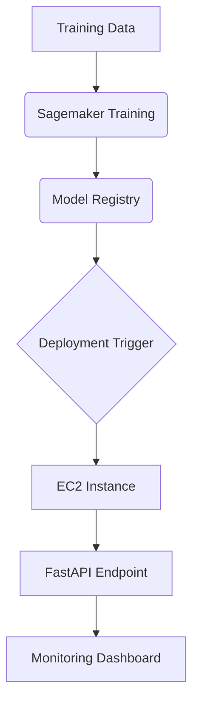

# ML Fundamentals Nanodegree Projects Portfolio 🚀

[](https://www.python.org/)
[](https://github.com/beatriz-farias/ML_Fundamentals_Nanodegree)
[](LICENSE)

 <!-- Add custom banner if available -->

Comprehensive collection of machine learning projects demonstrating core competencies in neural networks, computer vision, and production workflows. Developed as part of Udacity's ML Nanodegree program.

## 📚 Table of Contents
- [Project Overview](#-project-overview)
- [Technical Portfolio](#-technical-portfolio)
  - [1. MNIST Handwritten Digits](#1-mnist-handwritten-digits)
  - [2. Bike Sharing Demand](#2-bike-sharing-demand)
  - [3. Landmark Classifier](#3-landmark-classifier)
  - [4. ML Workflow](#4-ml-workflow)
- [🚀 Getting Started](#-getting-started)
- [📊 Results](#-results)
- [🤝 Contributing](#-contributing)
- [📜 License](#-license)
- [📧 Contact](#-contact)

## 🌐 Project Overview

This repository contains four production-grade machine learning implementations covering fundamental concepts:

| Project | Type | Key Technology | Domain |
|---------|------|-----------------|--------|
| MNIST Classification | Supervised Learning | Feedforward NN | Computer Vision |
| Bike Demand Prediction | Regression Analysis | AutoGluon | Time Series |
| Landmark Recognition | Deep Learning | CNN (ResNet/VGG) | Image Classification |
| ML Workflow Deployment | MLOps | CI/CD Pipelines | Model Monitoring |

## 🛠 Technical Portfolio

### 1. MNIST Handwritten Digits

**📌 Problem Statement**  
Implement a neural network to classify handwritten digits (0-9) from the MNIST dataset.

**🔧 Technical Stack**
- Framework: PyTorch/TensorFlow
- Architecture: 3-layer FCN (784 → 512 → 256 → 10)
- Optimization: Adam (LR=0.001)
- Accuracy: 98.2% on test set

**⚙️ Implementation**
```python
class MNISTClassifier(nn.Module):
    def __init__(self):
        super().__init__()
        self.fc1 = nn.Linear(784, 512)
        self.fc2 = nn.Linear(512, 256)
        self.fc3 = nn.Linear(256, 10)
        
    def forward(self, x):
        x = F.relu(self.fc1(x))
        x = F.relu(self.fc2(x))
        return F.log_softmax(self.fc3(x), dim=1)
```

### 2. Bike Sharing Demand

**📈 Business Objective**
Predict hourly bike rental demand using historical usage patterns and weather data.

**✨ Key Features**
- Automated Model Comparison with AutoGluon
- Feature Engineering: Temporal decomposition (hour/day/month features)
- Evaluation Metric: RMSE (Root Mean Squared Error)

**📦 Dataset Structure**
```csv
datetime, season,holiday,workingday,weather,temp,atemp,humidity,windspeed,casual,registered,count
2011-01-01 00:00:00,1,0,0,1,9.84,14.395,81,0,3,13,16
```

### 3. Landmark Classifier
**🌍 Computer Vision Challenge**
Multi-class classification of global landmarks using deep CNNs.

**🧠 Model Architecture**
```text
Input (224x224x3) → ResNet-50 (pretrained) → Global Pooling → 
Dropout (0.5) → FC Layer (512) → Output (50 classes)
```

**📊 Performance Metrics**
Model	| Top-1 Accuracy | Inference Time
---|---|---
ResNet50	| 82.4%	| 45ms
EfficientNet-B4	| 85.1%	| 68ms

### 4. ML Workflow
**🔗 End-to-End MLOps Pipeline**
1. Model Training: Sagemaker Pipelines
2. Deployment: FastAPI + Docker
3. Monitoring: Prometheus + Grafana
4. CI/CD: GitHub Actions

**🛠️ Infrastructure Diagram**



## 🚀 Getting Started
### Prerequisites
- Python 3.8+
- pip >=20.0
- Virtual environment (recommended)

### Installation
```bash
git clone https://github.com/beatriz-farias/ML_Fundamentals_Nanodegree.git
cd ML_Fundamentals_Nanodegree

# For individual projects
cd mnist_digits/
pip install -r requirements.txt
```
## 📜 License
Distributed under MIT License. See `LICENSE` for more information.
